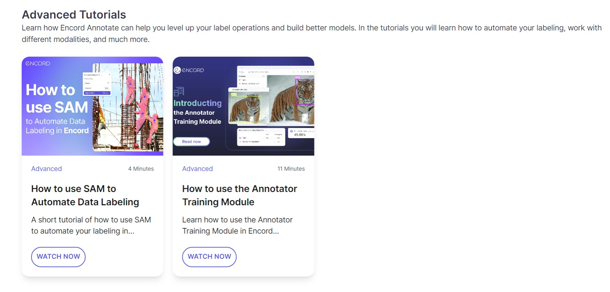
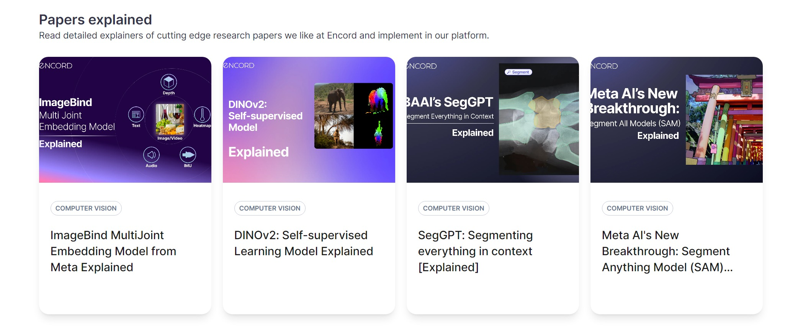

<div align="center">
  <p>
    <a align="center" href="" target="_blank">
      
    </a>
  </p>
</div>

<div align="center" dir="auto">

<a target="_blank" rel="noopener noreferrer nofollow" href="https://camo.githubusercontent.com/1a088dbe61584d1b213517c05e313c765ca127ce21118626b2d0db0b8f573235/68747470733a2f2f696d672e736869656c64732e696f2f6769746875622f6c6963656e73652f656e636f72642d7465616d2f656e636f72642d616374697665"></a>
<a href="https://www.piwheels.org/project/encord-active/" rel="nofollow"></a>
<a target="_blank" rel="noopener noreferrer nofollow" href="https://camo.githubusercontent.com/890ceffab6602e1a6ecac875e179b3984708f98b0a91293e6c632752d11bad7e/68747470733a2f2f696d672e736869656c64732e696f2f707970692f707976657273696f6e732f656e636f72642d616374697665"></a>

<a href="https://docs.encord.com/active/docs" rel="nofollow"></a>
<a href="https://discord.gg/TU6yT7Uvx3" rel="nofollow"></a>
<a href="https://github.com/encord-team/encord-notebooks" rel="nofollow"></a>


</p>
<p dir="auto">
<a href="https://twitter.com/encord_team" rel="nofollow"></a></p>
</div>

---

<br>


# **📓 Encord Notebooks**


<br>

Hi there, 👋!

Welcome to 🟣 Encord's Notebook repository! This repository provides a set of example notebooks covering a range of guides on: 
* 👁️ **Computer vision**
* 🤖 **Active learning**
* 🏷️ **Data labeling and annotation**
* 🧱 **Foundation models**
* 🔬 **Model quality evaluation**
* 🪄 **Generative AI**
* ⛽ **Data-centric AI**

<br>

> We provide a collection of example Jupyter notebooks that cover a wide range of scenarios related to computer vision data operations. These notebooks are well-documented and easy to understand, making it convenient for you to explore and apply the concepts in your own projects.

<br/>

---

<br>

## **All the exciting stuff 👇**

- [**📓 Encord Notebooks**](#-encord-notebooks)
  - [**All the exciting stuff 👇**](#all-the-exciting-stuff-)
  - [**👟 Instructions to run the notebooks locally**](#-instructions-to-run-the-notebooks-locally)
  - [**🟣 Getting Started with Encord Active Notebooks**](#-getting-started-with-encord-active-notebooks)
  - [**🧹 Data Quality Notebooks**](#-data-quality-notebooks)
  - [**🔬 Model Quality Evaluation Notebooks**](#-model-quality-evaluation-notebooks)
  - [**🧱 Foundation Models Notebooks**](#-foundation-models-notebooks)
  - [**🚧 Coming Soon!**](#-coming-soon)
  - [**🧠 Encord Learning Hub**](#-encord-learning-hub)
  - [**🪲 Bug report**](#-bug-report)
  - [**⚡Contributions**](#contributions)
  - [**📜 License**](#-license)

<br/>

---

<br>

## **👟 Instructions to run the notebooks locally**

To get started with the notebooks locally, follow these steps:

1. Clone the repository to your local machine and navigate to the `notebooks` directory:

```bash
git clone https://github.com/encord-team/encord-notebooks.git

cd notebooks
```
2. Create a python virtual environment and activate it:

```bash
python3 -m venv encord_notebooks
source venv/bin/activate
```

4. Install the dependencies in the  `requirements.txt` file:

```bash
pip install -r requirements.txt
```

5. Open Jupyter Notebook, JupyterLab, or any Notebook IDE of your choice.

6. Explore the example notebooks provided in the folder. Each notebook is self-contained and focuses on a specific aspect of model testing or data labeling. At the end of each notebook, you'll see options to navigate to the previous or next ones.

7. Customize the notebooks based on your specific requirements. You can modify the code, replace placeholder data, or integrate your own models and datasets.

> 🚀 Run the 📔notebooks and observe the outputs. Experiment with different settings and parameters to see how they affect your results.

<br/>

---

<br>

## **🟣 Getting Started with Encord Active Notebooks**

| **📓 Encord Notebook**                                                                                                                                                                                      |                                                                    **🚀 Launch Notebook**                                                                    |                                                            **📰 Description**                                                            |                                             **📺 Video Explainer**                                             |                                                                                                                       **💡Other Resources** |
| :--------------------------------------------------------------------------------------------------------------------------------------------------------------------------------------------------------- | :---------------------------------------------------------------------------------------------------------------------------------------------------------: | :-------------------------------------------------------------------------------------------------------------------------------------: | :-----------------------------------------------------------------------------------------------------------: | -----------------------------------------------------------------------------------------------------------------------------------------: |
| [🟣 Encord Active - Download Sandbox Project](./notebooks/01_Encord_Active_Notebooks___Download_sandbox_project.ipynb)                                                                                      | [](https://colab.research.google.com/drive/1l4K-QPOqBC4mv2SGADEe2erd5nhFVjoU?usp=sharing) |       This notebook gives you a quick way to test 🟣 Encord Active with a sandbox project and without installing anything locally.       |                                                                                                               | 📑 [Encord Active Documentation - Touring the Coco Sandbox Dataset](https://docs.encord.com/active/docs/tutorials/touring-the-coco-dataset) |
| [🟣 Encord Active - Getting Started with Encord Projects](./notebooks/02_Encord_Active___Import_project_(self_hosting).ipynb)                                                                               | [](https://colab.research.google.com/drive/1pchKiSZPiu2ENp0pr7iSs3L4JqO6cNAr?usp=sharing) |                          This 📓 notebook shows you how to import existing Encord projects into 🟣 Encord Active                          | ▶️ [How to Create an Annotation Project](https://encord.com/learning-hub/how-to-create-an-annotation-project/) |                                           📑 [Encord Documentation - Projects Overview](https://docs.encord.com/projects/projects-overview) |
| [🟣 Encord Active - 🏗️ Building a Custom Metric Function](./notebooks/Encord_Active_Building_a_Custom_Metric_Function.ipynb)                                                                                 | [](https://colab.research.google.com/drive/1oLA-EnKTtrYHJRn1KNjglWDAVUsxD6bq?usp=sharing) |               This 📓 notebook will take you through how to write such metric functions and use them with 🟣 Encord Active                |                                                                                                               |                       📑 [Encord Documentation - Writing Custom Quality Metric](https://docs.encord.com/active/docs/metrics/write-your-own) |
| [🟣 Encord Active - Add Custom Embeddings](./notebooks/Encord_Active_Add_Custom_Embeddings.ipynb)                                                                                                           | [](https://colab.research.google.com/drive/1mYEF2K-5Yp76cRaq-HOKT19UeUcDK3tu?usp=sharing) |             In this 📓 notebook, learn about the three different types of embeddings in 🟣 Encord Active and how to use them              |                                                                                                               |
| [🟣 Encord Notebooks - 🧵 Generate Encord Active Model Segmentation Masks Using Encord Annotate Micro-Models](./Import-Encord-Active-Model-Predictions/Micromodels-generate-segmentation-predictions.ipynb)  | [](https://colab.research.google.com/drive/1CBTUgowsUCm9JGMP_mbQ7GkIfbSqRh4z?usp=sharing) | In this short notebook walkthrough, learn how to generate segmentation masks with 🟣 Encord Active using Micro-Models in Encord Annotate |                                                                                                               |                          ▶️ [Encord Learning Hub - How to Build a Micro-model](https://encord.com/learning-hub/how-to-build-a-micro-model/) |
| [🟣 Encord Notebooks - 📦 Generate Encord Active Model Object Detection Boxes Using Encord Annotate Micro-Models](./Import-Encord-Active-Model-Predictions/Micromodels-generate-detection-predictions.ipynb) | [](https://colab.research.google.com/drive/1nwdSHFonQBEYEhywLfQPkMMya0xTOjdc?usp=sharing) |   In this short notebook walkthrough, learn how to generate bounding boxes with 🟣 Encord Active using Micro-Models in Encord Annotate   |                                                                                                               |                          ▶️ [Encord Learning Hub - How to Build a Micro-model](https://encord.com/learning-hub/how-to-build-a-micro-model/) |


<br/>

---

<br>

## **🧹 Data Quality Notebooks**

| **📓 Encord Notebook**                                                                                                  |                                                                    **🚀 Launch Notebook**                                                                    |                                                                 **📰 Description**                                                                 | **📺 Video Explainer** |                                                                                                                    **💡Other Resources** |
| :--------------------------------------------------------------------------------------------------------------------- | :---------------------------------------------------------------------------------------------------------------------------------------------------------: | :-----------------------------------------------------------------------------------------------------------------------------------------------: | :-------------------: | --------------------------------------------------------------------------------------------------------------------------------------: |
| [🟣 Encord Active - 🔦 Torchvision Dataset Exploration](./notebooks/Encord_Active_Torchvision_Dataset_Exploration.ipynb) | [](https://colab.research.google.com/drive/1zVIyqsF5fpDNsjFLLKPvI2VXPSMdQ2T5?usp=sharing) | In this notebook, you will use 🟣 Encord Active to explore the quality of a dataset from the built-in samples in the `torchvision.datasets` module |                       | [Encord Active Documentation - Exploring data distribution](https://docs.encord.com/active/docs/workflows/understand-data-distribution) |
| [🟣 Encord Active - 🤗 HuggingFace Dataset Exploration](./notebooks/Encord_Active_HuggingFace_Dataset_Exploration.ipynb) | [](https://colab.research.google.com/drive/1Ohsd1BrO6s9HuliYdHqMsIblaR9KXbpk?usp=sharing) |             In this notebook, you will use 🟣 Encord Active to explore the quality of a dataset from the Hugging Face Datasets library             |                       | [Encord Active Documentation - Exploring data distribution](https://docs.encord.com/active/docs/workflows/understand-data-distribution) |


<br/>

---

<br>

## **🔬 Model Quality Evaluation Notebooks**

| **📓 Encord Notebook**                                                                                                                                                                                 |                                                                    **🚀 Launch Notebook**                                                                    |                                                               **📰 Description**                                                               | **📺 Video Explainer** |                                                                                                                                          **💡Other Resources** |
| :---------------------------------------------------------------------------------------------------------------------------------------------------------------------------------------------------- | :---------------------------------------------------------------------------------------------------------------------------------------------------------: | :-------------------------------------------------------------------------------------------------------------------------------------------: | :-------------------: | ------------------------------------------------------------------------------------------------------------------------------------------------------------: |
| [🟣 Encord Notebooks - 🆚 Grounding-DINO+SAM vs. Mask-RCNN](./notebooks/Encord_Notebooks_Team_gDINO+SAM_vs_maskrcnn_webinar.ipynb) | [](https://colab.research.google.com/drive/1MKlB0AU8yaCwSvnaAPO3B1sHHP9xcsM1?usp=sharing) | In this notebook file, you will get and evaluate the segmentation predictions of images using Grounding-DINO and Segment Anything Model (SAM) |  ▶️ [Encord Learning Hub - Are VFMs on par with SOTA?](https://encord.com/learning-hub/are-vfms-on-par-with-sota/)         | • [🟣 Encord Notebooks - 🔧 Zero-Shot Image Segmentation with Grounding-DINO + Segment Anything Model (SAM)](./notebooks/Encord_Notebooks_Zero_shot_image_segmentation_with_grounding_dino_and_sam.ipynb) <br> • 📖 [Encord Blog - Grounding-DINO + Segment Anything Model (SAM) vs Mask-RCNN: A comparison](https://encord.com/blog/grounding-dino-sam-vs-mask-rcnn-comparison/)  |


<br/>


---

<br>

## **🧱 Foundation Models Notebooks**

| **📓 Encord Notebook**                                                                                                             |                                                                    **🚀 Launch Notebook**                                                                    |                                                 **📰 Description**                                                  | **📺 Video Explainer** |                                                                                                                                                                                                                                                                                                                                                                                                                                                                                                                                                     **💡Other Resources** |
| :-------------------------------------------------------------------------------------------------------------------------------- | :---------------------------------------------------------------------------------------------------------------------------------------------------------: | :----------------------------------------------------------------------------------------------------------------: | :-------------------: | -----------------------------------------------------------------------------------------------------------------------------------------------------------------------------------------------------------------------------------------------------------------------------------------------------------------------------------------------------------------------------------------------------------------------------------------------------------------------------------------------------------------------------------------------------------------------: |
| [🟣 Encord Notebooks - 🔧 How to fine-tune Segment Anything Model (SAM)](./notebooks/Encord_Notebooks_How_To_Fine_Tuning_SAM.ipynb) | [](https://colab.research.google.com/drive/1XeMSjS7F4QTTI0BSo0MJ6oA7Aj9Pz_UD?usp=sharing) | This is the notebook gives you a walkthrough on fine-tuning Segment Anything Model (SAM) to a specific application |                       | • 📖 [Encord's Blog - How To Fine-Tune Segment Anything](https://encord.com/blog/learn-how-to-fine-tune-the-segment-anything-model-sam/)     <br> • ▶️ [Encord Learning Hub - How to use SAM to Automate Data Labeling](https://encord.com/learning-hub/how-to-use-sam-to-automate-data-labeling/) <br> • 📖 [Encord's Blog - Meta AI's New Breakthrough: Segment Anything Model (SAM) Explained](https://encord.com/blog/segment-anything-model-explained/) <br> • 📖 [Segment Anything (SAM) is live in Encord](https://encord.com/blog/segment-anything-live-in-encord/). |
| [🟣 Encord Notebooks - 🔎 Building Semantic Search for Visual Data](./notebooks/Encord_Notebooks_Building_Semantic_Search_for_Visual_Data.ipynb) | [](https://colab.research.google.com/drive/13SjdECFWlTZVgXGazxOBcNSjqR5C0b8a?usp=sharing) | In this notebook, you will build a semantic search engine using CLIP and ChatGPT |     ▶️ [Encord's YouTube Channel - How to build Semantic Visual Search with ChatGPT and CLIP](https://youtu.be/_thRPX91WLM)                  | ▶️ [Webinar - Webinar: How to build Semantic Visual Search with ChatGPT and CLIP](https://encord.com/blog/webinar-semantic-visual-search-chatgpt-clip/)   |


<br/>

---

<br>

## **🚧 Coming Soon!**

- [ ] 🏷️ Data Labeling Notebooks

- [ ] 📦 Object Detection Notebooks

- [ ] ➰ Active Learning Notebooks

<br/>

---

<br>

## **🧠 Encord Learning Hub**

The [Encord Learning Hub](https://encord.com/learning-hub/) provides video tutorials and courses to help you streamline your computer vision data operations. 

In the hub, learn the basics of Encord Annotate with introductory video explainers on how you can annotate data, manage your annotaion taskforce, and so on.

[](https://encord.com/learning-hub/)


You can also learn how to level up your label operations and build better models with state-of-the-art research assets.

[](https://encord.com/learning-hub/)


The page also contains detailed explainers of cutting edge research papers that Encord likes and implements in their platform.

[](https://encord.com/learning-hub/)

<br/>

---
<br>

## **🪲 Bug report**
Thank you for going through the walkthrough. If you are encountering challenges running any of the notebooks, please create a [bug report](https://github.com/encord-team/encord-notebooks/labels/bug). Here are some guidelines to follow before creating a bud report:
* Search for existing issues before reporting a bug.
* Update to the latest version of [Encord Active](https://github.com/encord-team/encord-active) and followed the [installation guide](https://docs.encord.com/active/docs/installation/).
* Provide a descriptive title and detailed description of the bug.
* Include steps to reproduce, environment information, error messages/logs, and expected outcome.
* Be specific, provide context, and include the notebook or relevant files/screenshots if applicable.

<br/>

---

<br>

## **⚡Contributions**

We follow a [code of conduct](https://github.com/encord-team/encord-active/blob/main/CODE_OF_CONDUCT.md) when participating in the community. Please read it before you make any contributions. If you make any pull requests to this repo, then you are assigning copyright of that work to Encord.

* If you plan to work on an issue, mention so in the [issue page](https://github.com/encord-team/encord-notebooks/issues) before you start working on it.
* If you have an idea for a notebook or tutorial, kindly create an issue and share it with other community members/maintainers.
* Ask for help in our [Discord community](https://discord.gg/TU6yT7Uvx3).
* Please include the file name and a brief description of any spelling or text changes. The reviewers may struggle to identify corrections.

Please ensure that your contributions align with the repository's goals and adhere to the project's license.

<br/>

---

<br>


## **📜 License**

The repository is licensed under the Apache License 2.0. This permissive open source license grants you the freedom to use, modify, and distribute the code and example notebooks for both commercial and non-commercial purposes. 

By utilizing the notebooks and its associated resources, you agree to comply with the terms and conditions specified in the [Apache License 2.0](http://www.apache.org/licenses/LICENSE-2.0). You can find a copy of the license in the [LICENSE](./LICENSE) file in this repository for more details.

<br/>